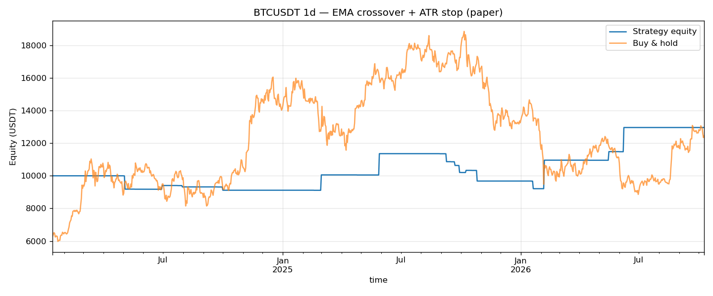

# Crypto Signal Agent — EMA Trend Strategy with Paper-Trading Agent

A self-contained Python project that combines two skills in one codebase:

1. **A trading strategy** — EMA(20/50) crossover trend following with an RSI
   over-extremes filter and an ATR-based trailing stop, backtested against
   real exchange candles with fees, next-bar execution (no look-ahead), and
   full risk metrics.
2. **An always-on agent** — polls the exchange for new closed candles,
   evaluates the strategy, maintains a simulated (paper) position, persists
   its state across restarts, and pushes alerts to console / log file /
   Telegram. No real orders are ever sent.

Works with **Binance** and **Bybit** public market data out of the box
(Gate.io is included as a fallback source). No API keys are needed for
market data.

## Quick start

```bash
pip install -r requirements.txt

# 1) Backtest (downloads real candles, writes results/ + equity chart)
python run_backtest.py --bars 1000

# 2) Run the agent once (single evaluation cycle — good for demos / cron)
python agent.py --once

# 3) Or run it continuously
python agent.py
```

Configuration lives in `config.yaml` — exchange, symbol, timeframe,
strategy parameters, fees and polling interval are all adjustable without
touching code.

## Backtest results (default config)

Binance BTCUSDT, daily candles, 1,000 bars (Jan 2024 – Oct 2026),
$10,000 starting equity, 0.05% fee per side:

| Metric | Strategy | Buy & Hold |
|---|---|---|
| Total return | **+29.6%** | +24.4% |
| Final equity | $12,960 | $12,440 |
| Trades | 16 | — |
| Win rate | 50.0% | — |
| Profit factor | 1.95 | — |
| Max drawdown | −18.9% | — |
| Sharpe | 0.58 | — |



Full trade log in `results/trades.csv`, machine-readable metrics in
`results/backtest_stats.json`.

> Honest note on parameters: the same strategy on 4h candles loses money
> (−6.2% over a 1,000-bar sample) — fee drag and crossover whipsaws dominate
> at that frequency. Trend following needs room to breathe; daily bars are
> its home ground. The backtester exists precisely so claims like this are
> checked against data instead of vibes.

## How it works

```
                 ┌─────────────┐   candles    ┌──────────────┐
  Binance/Bybit ─┤  src/data   ├─────────────►│ src/strategy │
  public REST    └─────────────┘              │ EMA · RSI    │
                                              │ ATR stops    │
                                              └──────┬───────┘
                                                     │ signals
                          ┌──────────────────────────▼─────────────────┐
                          │ agent.py — live loop                        │
                          │ · poll for latest closed candle             │
                          │ · flip paper position on trend change       │
                          │ · ATR trailing-stop exit                    │
                          │ · state persisted to state/agent_state.json │
                          │ · alerts: console / log / Telegram          │
                          └─────────────────────────────────────────────┘
```

- `src/data.py` — exchange adapters (Binance primary + mirror fallback,
  Bybit v5, Gate) returning a normalized OHLCV DataFrame.
- `src/strategy.py` — indicators (EMA, RSI, ATR), crossover detection,
  RSI entry filter, trailing-stop calculation. Pure functions, easy to
  extend with new rules.
- `src/backtest.py` — event-style backtester. Signals are decided at bar
  close and filled at the next bar's open; stops are checked intrabar.
  Computes return vs buy & hold, win rate, profit factor, max drawdown
  and Sharpe.
- `src/notify.py` — alert sink: stdout, append-only log file, optional
  Telegram bot (set `TELEGRAM_BOT_TOKEN` / `TELEGRAM_CHAT_ID`, see
  `.env.example`).
- `agent.py` — the runtime. `PaperAccount` tracks equity, position and
  realized PnL; swap it for a signed private-API client to go live.

## Sample agent output

```
[2026-10-09 04:44:19 UTC] Agent started: binance BTCUSDT 1d (paper trading)
[2026-10-09 04:44:20 UTC] SIGNAL LONG BTCUSDT 1d @ 81,704.37 | EMA20=83,335.9 EMA50=79,654.4 RSI=46.9 ATR=2,222.7 | equity $9,995.00
```

## Extending it

- **New exchange**: add a fetcher in `src/data.py` returning the same
  DataFrame shape and register it in `FETCHERS`.
- **New strategy rule**: add an indicator in `src/strategy.py` and gate
  entries in `signal_allowed` — the backtester and live agent pick it up
  automatically since both share `PaperAccount` and the strategy module.
- **Live trading**: replace `PaperAccount.open/close` calls with signed
  REST orders (Binance / Bybit private endpoints). Keep the agent on
  testnet until the fill logic is proven.

## Disclaimer

Educational / portfolio project. Not financial advice; past backtest
performance does not predict future returns. Trading cryptocurrency
carries substantial risk.
